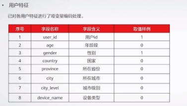
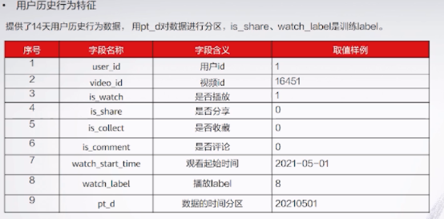
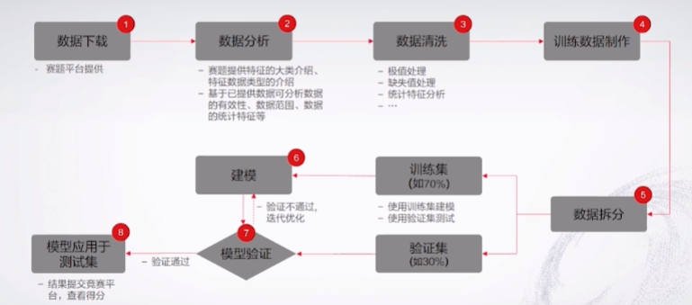
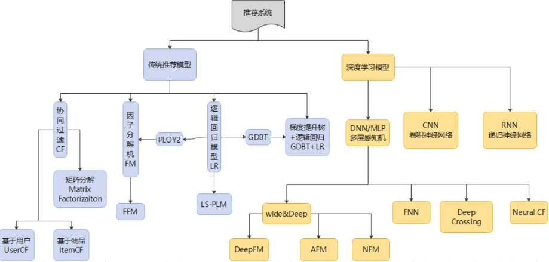
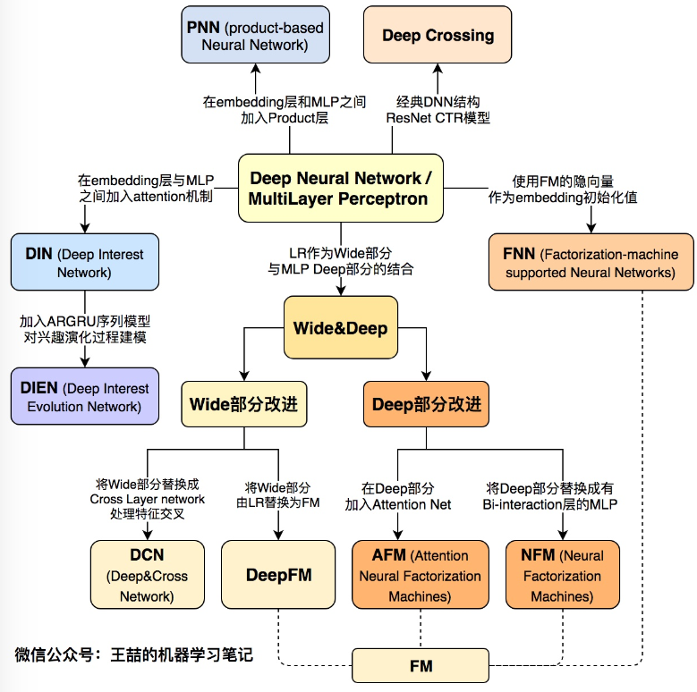
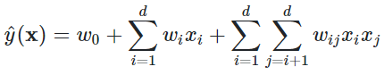
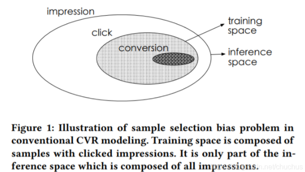

推荐系统大多都是基于隐式反馈来做推荐，比如用户的点击、观看时长、评论、分享等，且不同隐式反馈表达了用户不同的喜好程度。如果仅仅以单目标对推荐结果进行衡量，会存在衡量不全面的问题。

在视频推荐中如果仅仅以点击为目标，可能忽视了用户更深层次的隐式反馈。因此，视频推荐除了关注用户点击，还需关注用户观看时长、分享等目标


### **赛题说明**

本赛题提供14天数据用于训练，1天数据用于测试，数据包括用户特征，视频内容特征，以及用户历史行为数据。

目标是预测每位用户观看视频时长所在区间，且预测是否对视频进行分享。











### 算法






其实其中关键点就一个



第二项 特征简单线性加权和

第三项 特征交叉相关性度量之和，这一项就是向量内积，不过多了个权重项


以上模型就是在 这两项 玩出花来。DeepFM 将 $w_{ij}$ 转化为两个embedding向量的内积。


建模本身的缺陷




使用简单的DeepFM

```python
class DeepFM(nn.Module):
    def __init__(self, cate_fea_nuniqs, nume_fea_size=0, emb_size=8, 
                        hid_dims=[256, 128], num_classes=1, dropout=[0.2, 0.2]): 
        """
        cate_fea_nuniqs: 类别特征 n unique name.
        nume_fea_size: 数值特征维度
        """
        super().__init__()
        self.cate_fea_size = len(cate_fea_nuniqs)
        self.nume_fea_size = nume_fea_size
        
        """FM部分"""
        # 一阶
        if self.nume_fea_size != 0:
            self.fm_1st_order_dense = nn.Linear(self.nume_fea_size, 1)  # 数值特征的一阶表示
        self.fm_1st_order_sparse_emb = nn.ModuleList([
            nn.Embedding(voc_size, 1) for voc_size in cate_fea_nuniqs])  # 类别特征的一阶表示
        
        # 二阶
        self.fm_2nd_order_sparse_emb = nn.ModuleList([
            nn.Embedding(voc_size, emb_size) for voc_size in cate_fea_nuniqs])  # 类别特征的二阶表示
        
        """DNN部分"""
        self.all_dims = [self.cate_fea_size * emb_size] + hid_dims
        self.dense_linear = nn.Linear(self.nume_fea_size, self.cate_fea_size * emb_size)  # 数值特征的维度变换到FM输出维度一致
        self.relu = nn.ReLU()
        # for DNN 
        for i in range(1, len(self.all_dims)):
            setattr(self, 'linear_'+str(i), nn.Linear(self.all_dims[i-1], self.all_dims[i]))
            setattr(self, 'batchNorm_' + str(i), nn.BatchNorm1d(self.all_dims[i]))
            setattr(self, 'activation_' + str(i), nn.ReLU())
            setattr(self, 'dropout_'+str(i), nn.Dropout(dropout[i-1]))
        # for output 
        self.dnn_linear1 = nn.Linear(hid_dims[-1]+2, 10)  # 10 watch label
        self.dnn_linear2 = nn.Linear(hid_dims[-1], 1)
        
    def forward(self, X_sparse, X_dense=None):
        """
        X_sparse: 类别型特征输入  [bs, cate_fea_size]
        X_dense: 数值型特征输入（可能没有）  [bs, dense_fea_size]
        """
        
        """FM 一阶部分"""
        
        print('self.fm_1st_order_sparse_emb', len(self.fm_1st_order_sparse_emb))
        
        fm_1st_sparse_res = [emb(X_sparse[:, i].unsqueeze(1)).view(-1, 1)  for i, emb in enumerate(self.fm_1st_order_sparse_emb)]
        fm_1st_sparse_res = torch.cat(fm_1st_sparse_res, dim=1)  # [bs, cate_fea_size]
        fm_1st_sparse_res = torch.sum(fm_1st_sparse_res, 1,  keepdim=True)  # [bs, 1]
        
        if X_dense is not None:
            fm_1st_dense_res = self.fm_1st_order_dense(X_dense) 
            fm_1st_part = fm_1st_sparse_res + fm_1st_dense_res
        else:
            fm_1st_part = fm_1st_sparse_res   # [bs, 1]
        
        """FM 二阶部分"""
        fm_2nd_order_res = [emb(X_sparse[:, i].unsqueeze(1)) for i, emb in enumerate(self.fm_2nd_order_sparse_emb)]
        fm_2nd_concat_1d = torch.cat(fm_2nd_order_res, dim=1)  # [bs, n, emb_size]  n为类别型特征个数(cate_fea_size)
        
        # 先求和再平方
        sum_embed = torch.sum(fm_2nd_concat_1d, 1)  # [bs, emb_size]
        square_sum_embed = sum_embed * sum_embed    # [bs, emb_size]
        # 先平方再求和
        square_embed = fm_2nd_concat_1d * fm_2nd_concat_1d  # [bs, n, emb_size]
        sum_square_embed = torch.sum(square_embed, 1)  # [bs, emb_size]
        # 相减除以2 
        sub = square_sum_embed - sum_square_embed  
        sub = sub * 0.5   # [bs, emb_size]
        
        fm_2nd_part = torch.sum(sub, 1, keepdim=True)   # [bs, 1]
        
        """DNN部分"""
        dnn_out = torch.flatten(fm_2nd_concat_1d, 1)   # [bs, n * emb_size]
        
        if X_dense is not None:
            dense_out = self.relu(self.dense_linear(X_dense))   # [bs, n * emb_size]
            dnn_out = dnn_out + dense_out   # [bs, n * emb_size]
        
        for i in range(1, len(self.all_dims)):
            dnn_out = getattr(self, 'linear_' + str(i))(dnn_out)
            dnn_out = getattr(self, 'batchNorm_' + str(i))(dnn_out)
            dnn_out = getattr(self, 'activation_' + str(i))(dnn_out)
            dnn_out = getattr(self, 'dropout_' + str(i))(dnn_out)
        
        # watch predict
        out1 = self.dnn_linear1(torch.cat([dnn_out, fm_1st_part, fm_2nd_part],1))   # [bs, N]
         
         # share predict
        dnn_out2 = self.dnn_linear2(dnn_out)   # [bs, 1]
        out2 = fm_1st_part + fm_2nd_part + dnn_out2   # [bs, 1]
        
        return out1, out2
```


### Resource

Elo Merchant Category Recommendation

https://www.kaggle.com/c/elo-merchant-category-recommendation

赛题任务：客户忠诚度打分评价指标：RMSE

[第1名](https://www.kaggle.com/c/elo-merchant-category-recommendation/discussion/82036)[第5名](https://www.kaggle.com/c/elo-merchant-category-recommendation/discussion/82314)[第7名](https://www.kaggle.com/c/elo-merchant-category-recommendation/discussion/82055)[第10名](https://www.kaggle.com/c/elo-merchant-category-recommendation/discussion/82093)[第11名](https://www.kaggle.com/c/elo-merchant-category-recommendation/discussion/82127)[第13名](https://www.kaggle.com/c/elo-merchant-category-recommendation/discussion/80132)[第16名](https://www.kaggle.com/c/elo-merchant-category-recommendation/discussion/82166)[第18名](https://www.kaggle.com/c/elo-merchant-category-recommendation/discussion/82107)[第19名](https://www.kaggle.com/c/elo-merchant-category-recommendation/discussion/82178)[第21名](https://www.kaggle.com/c/elo-merchant-category-recommendation/discussion/82235)[第22名](https://www.kaggle.com/c/elo-merchant-category-recommendation/discussion/82057)[第24名](https://www.kaggle.com/c/elo-merchant-category-recommendation/discussion/75935)[第31名](https://www.kaggle.com/c/elo-merchant-category-recommendation/discussion/82084)


Expedia Hotel Recommendations

https://www.kaggle.com/c/expedia-hotel-recommendations

赛题任务：给用户推荐个性化酒店评价指标：MAP@5

[第1名](https://www.kaggle.com/c/expedia-hotel-recommendations/discussion/21607)


Santander Product Recommendation

https://www.kaggle.com/c/santander-product-recommendation/

赛题任务：给用户推荐个性化金融商品评价指标：MAP@7

[第1名](https://www.kaggle.com/c/santander-product-recommendation/discussion/26835)[第2名](http://blog.kaggle.com/2017/01/12/santander-product-recommendation-competition-2nd-place-winners-solution-write-up-tom-van-de-wiele/)[第3名](http://blog.kaggle.com/2017/02/22/santander-product-recommendation-competition-3rd-place-winners-interview-ryuji-sakata/)[第5名](https://www.kaggle.com/c/santander-product-recommendation/discussion/26841)[第8名](https://github.com/yaxen/santander-product-recommendation-8th-place)[第9名](https://www.kaggle.com/c/santander-product-recommendation/discussion/26809)[第11名](https://github.com/vopani/Kaggle_SantanderProductRecommendation)


WSDM - KKBox's Music Recommendation Challenge

https://www.kaggle.com/c/kkbox-music-recommendation-challenge

赛题任务：对用户完成音乐推荐评价指标：AUC

[第3名](https://www.kaggle.com/c/kkbox-music-recommendation-challenge/discussion/45971)


Display Advertising Challenge

https://www.kaggle.com/c/criteo-display-ad-challenge

赛题任务：广告点击率预测评价指标：LogLoss

[第1名](https://www.kaggle.com/c/criteo-display-ad-challenge/discussion/10555)[第3名](https://www.kaggle.com/c/criteo-display-ad-challenge/discussion/10547)[第4名](https://www.kaggle.com/c/criteo-display-ad-challenge/discussion/10534)


Avito Demand Prediction Challenge

https://www.kaggle.com/c/avito-demand-prediction

赛题任务：在线搜索广告点击率预测评价指标：RMSE

[第1名](https://www.kaggle.com/c/avito-demand-prediction/discussion/59880)[第3名](https://www.kaggle.com/c/avito-demand-prediction/discussion/59885)[第4名](https://www.kaggle.com/c/avito-demand-prediction/discussion/59881)[第5名](https://www.kaggle.com/c/avito-demand-prediction/discussion/59914)[第7名](https://www.kaggle.com/c/avito-demand-prediction/discussion/60026)[第11名](https://www.kaggle.com/c/avito-demand-prediction/discussion/60154)[第13名](https://www.kaggle.com/c/avito-demand-prediction/discussion/59886)[第14名](https://www.kaggle.com/c/avito-demand-prediction/discussion/60059)[第18名](https://github.com/khuangaf/Kaggle-Avito-NN)[第20名](https://www.kaggle.com/c/avito-demand-prediction/discussion/59936)[第22名](https://www.kaggle.com/c/avito-demand-prediction/discussion/60102)[第24名](https://github.com/khumbuai/kaggle_avito_demand)[第30名](https://www.kaggle.com/c/avito-demand-prediction/discussion/60006)


Click-Through Rate Prediction

https://www.kaggle.com/c/avazu-ctr-prediction

赛题任务：移动广告点击率预测评价指标：Logarithmic Loss

[第1名](https://github.com/guestwalk/kaggle-avazu)


