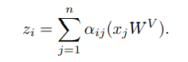
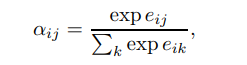
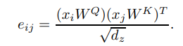
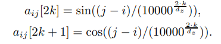
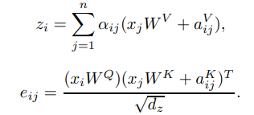

优质方案：[daguancup_-5th](https://github.com/effort-yq/daguancup_-5th)。简洁、清晰、方案精简。


> 风险事件以文本的形式存在，需要采用自然语言理解模型实现风险事件的高精度智能识别，其本质是属于一个文本分类任务。
>
> 任务是基于一定量的风险事件标注语料和大规模无标注的资讯文本，训练模型对资讯文本包含何种风险标签进行预测。
>
> 数据集：风险事件分类的训练集规模是10000+，包含9个一级标签和35个二级标签；大规模无标注的文本规模是亿级，可供语言模型训练。
>
> 评测采用macro F1指标。
>
> 训练集文件为csv格式，表头包含“id”、“text”、“label”，分别对应文本ID、文本内容和风险事件标签，每个文本只对应单个标签。标签形如“一级类别标签-二级类别标签”，标签经过脱敏处理，举例来说是“1-1”或者“2-3”


### NEZHA model

相比BERT，不同之处在于：

#### 使用 Functional Relative Positional Encoding

原本Tranformer在计算每个attention output z 时，是







位置编码是直接从输入中加入。

但是NEZHA使用相对位置计算：



在计算 z 时，加入相对位置编码：



#### Whole Word Masking

这没啥好说的

#### LAMB Optimizer and Mixed Precision Training

没啥好说的，LAMB可以看看，主要针对大batch size进行优化。


### 自定义 ngram order reconstruct 任务

作者的实现时在 ngram mask 的基础之上进行 重构单词顺序 的预训练任务。每个句子中只进行了一次顺序打乱操作。可以再进行修改实验。

每个句子中，随机一个位置，打乱相邻三个字的顺序。

打乱的位置 和 ngram mask 一起，80%的位置进行 [MASK] token 填充，20%变成随机token id。

label 中不是 ngram mask 位置 和 打乱词位置 的值都设为 -100，计算损失时不考虑。

```python
# pretrain data collector 中生成训练训练数据的方法

def mask_tokens(self, inputs: torch.Tensor, mask_labels: torch.Tensor) -> Tuple[torch.Tensor, torch.Tensor]:
        """在 ngram 基础上，增加 StructBert 中，重构单词顺序的任务。
        其它 datacollector 可参考 https://github.com/huggingface/transformers/blob/master/src/transformers/data/data_collator.py
        """
        labels = inputs.clone()
        ngram_mask_matrix = mask_labels

        bs = inputs.shape[0]
        # word struct prediction
        for i in range(bs):
            now_input = inputs[i]
            now_input = now_input.cpu().numpy().tolist()

            now_probability_matrix = ngram_mask_matrix[i]
            now_probability_matrix = now_probability_matrix.cpu().numpy().tolist()

            for j in range(len(now_input)):
                if now_input[j] == self.tokenizer.sep_token_id:
                    sep_index = j

            # skip cls_ids, sep_ids, pad_ids
            choose_range = now_input[1: sep_index - 2]
            if len(choose_range) == 0:
                choose_range = now_input[1: 5]  # min length

            # random choose index to apply words order shuffle
            rd_token = np.random.choice(choose_range)
            token_idx = now_input.index(rd_token)

            # words order shuffled
            tmp = now_input[token_idx: token_idx + 3]
            np.random.shuffle(tmp)

            # change data and mark
            now_input[token_idx: token_idx + 3] = tmp
            now_probability_matrix[token_idx: token_idx + 3] = [1, 1, 1]

            inputs[i] = torch.tensor(now_input)
            ngram_mask_matrix[i] = torch.tensor(now_probability_matrix)

        # set special tokens` values in ngram_mask_matrix to 0
        special_tokens_mask = [
            self.tokenizer.get_special_tokens_mask(val, already_has_special_tokens=True) for val in labels.tolist()
        ]
        ngram_mask_matrix.masked_fill_(torch.tensor(special_tokens_mask, dtype=torch.bool), value=0.0)
        masked_indices = ngram_mask_matrix.bool()

        # only reserve the ngram_mask labels, others all set to be -100. since we only compute loss on masked tokens
        labels[~masked_indices] = -100

        # 80% mask will be reserved, and set to "mask" token id.
        indices_replaced = torch.bernoulli(torch.full(labels.shape, 0.8)).bool() & masked_indices
        inputs[indices_replaced] = self.tokenizer.convert_tokens_to_ids(self.tokenizer.mask_token)

        # the rest 20% mask will be randomly changed to a random token id by a probability of 50%.
        indices_random = torch.bernoulli(
            torch.full(labels.shape, 0.5)).bool() & masked_indices & ~indices_replaced
        random_words = torch.randint(len(self.tokenizer), labels.shape, dtype=torch.long)
        inputs[indices_random] = random_words[indices_random]

        return inputs, labels
```

### 其他方法

- 对抗训练
- EMA
- lookahead优化器
- Training Signal Annealing (TSA)：模型在有标注数据上，先拟合预测概率小于 $\eta_t$ 的数据，逐渐调整 $\eta_t$，训练先难后易。Google UDA中提出的一种训练方法。