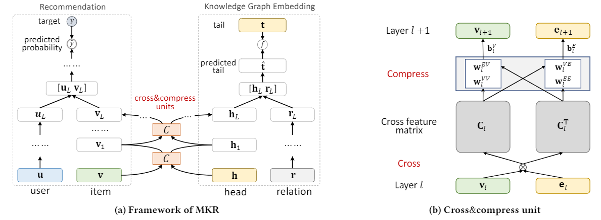

## 基于电影评分数据集和电影知识图谱

使用多任务端到端学习框架MKR(Multi-Task Feature Learning for Knowledge Graph Enhanced Recommendation)。

图（a） MKR的框架。左侧和右侧分别展示了推荐模块和KGE模块，它们由交叉压缩单元桥接。图（b） 交叉压缩装置的图示。cross & compress unit通过cross operation从项目和实体向量生成交叉特征矩阵，并通过compress operation输出向量以供下一层使用。

将电影关系和历史打分作为输入，预测用户对任何其他电影是否喜好。
模型每一层将 电影关系向量 和 用户打分信息向量，特征融合后再输入下一层。
预测评分部分，输入为 用户向量 和 电影向量；
实体图谱关系部分，输入为 head电影向量 和 关系向量，预测tail电影向量；
交叉融合部分，将 预测评分部分 和 实体图谱关系部分 的中间特征作为输入，输出交叉后的特征。

模型只是简单融合了电影实体之间的关系信息，算是小小地利用了一点属于知识图谱范畴的信息。

